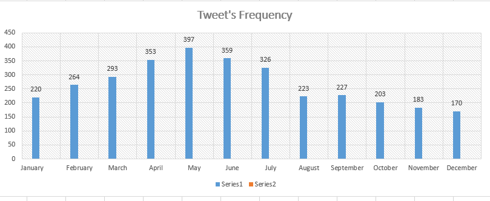
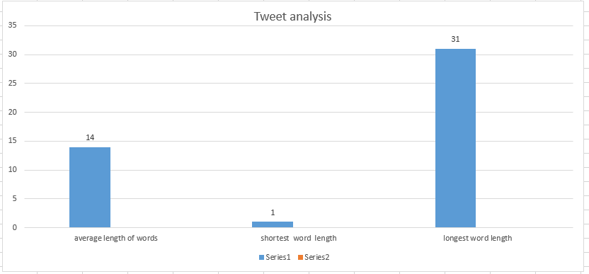
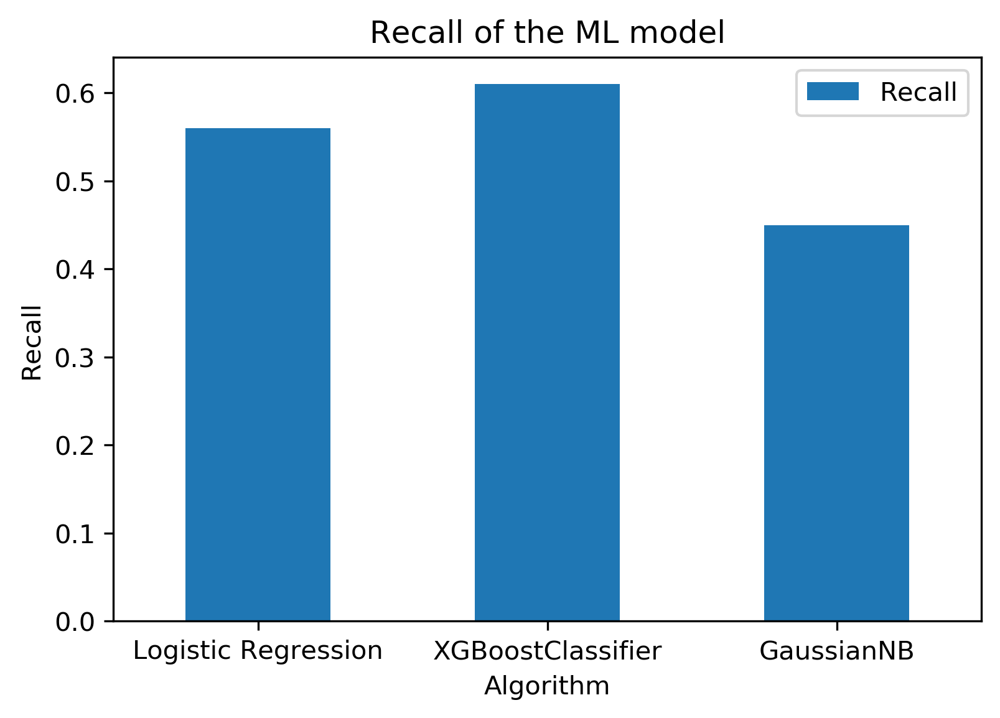

# Project report

## About this project

In this project we have tried to predict change in Tesla’s stock price from the tweets posted by Elon Musk.

## Resources used

1. The [tweets dataset](datasets/data_elonmusk.csv) contains all of Elon Musk's tweets from November 16, 2012 to September 29, 2017. This dataset was taken from [Kaggle](https://www.kaggle.com/kulgen/elon-musks-tweets).
2. The [stock price](datasets/tsla_stock_price.csv) was extracted using [pandas_datareader](https://pandas-datareader.readthedocs.io/en/latest/). Refer to the [code](datasets/extract_tsla_stock_price.py) for more information. This contains Date, Open, Close, Low, High prices and the Volume for Tesla's stock from November 16, 2012 to September 29, 2017.

## Exploratory Data Analysis

1. In which month does Elon Musk tweet the most?

2. Short analysis

## Project flow

1. Data pre-processing
- Extract date from the column called "Time".
- Sort the dataset by date, in ascending order.
- Drop unwanted columns like "row ID", "Time", "Retweet from" and "User".
- To merge this dataset with the stock price data, we need to make it into a day-wise dataset and as there can be multiple tweets in a day, our best approach to solve this problem was to concatenate all the tweets which were tweeted on the same day.
- Merge with stock price dataset.
- Our price difference was calculated by using the formula price_diff = Close - Open. So, we would know whether the stock price that day ended on a positive value or negative value.
- If the value was positive, our target variable would be equal to 1 else it would be equal to 0.
- Drop unwanted columns like "High", "Low", "Volume", "Adj Close" and "price_diff".
- Save it in csv format.

2. Natural Language Processing
- Use tokenization and lemmatization to remove unwanted words from the tweet and store all of them in a column called "new_tweet".
- Use TfidfVectorizer for pre-processing the tweets and store it in X in the form of an array.
- Convert X to a dataframe and add a new column called "len_tweets" which will store the length of each new_tweet.

3. Machine Learning
- Apply train test split on the dataset, use test_size = 0.2
- For this project, we have tried three algorithms, Logistic Regression, XGBoost and Naive Bayes Classifier.

## Model selection

For model selection, we need to look at accuracy, precision and recall. So, let's look at them one by one.

### Accuracy

Here, XGBoostClassifier is the best model as it has an accuracy of ~61% followed by Logistic Regression with an accuracy of ~55%.

### Precision

Here, XGBoostClassifier is the best model as it has a precision of 0.61 followed by Logistic Regression with a precision of 0.56.

### Recall

Here, XGBoostClassifier is the best model as it has a recall of 0.61 followed by Logistic Regression with a recall of 0.56.

## Conclusion

In the end, XGBoostClassifier is the best algorithm for our model as it performs the best compared to the other two.

## Future improvements

- Since we got an accuracy of ~61%, the best way to improve our model is to get more data.
- Another way to improve our model is to add more features which can distinguish tweets perfectly.
- Trying other machine learning algorithms like decision tree classifier or random forest.
